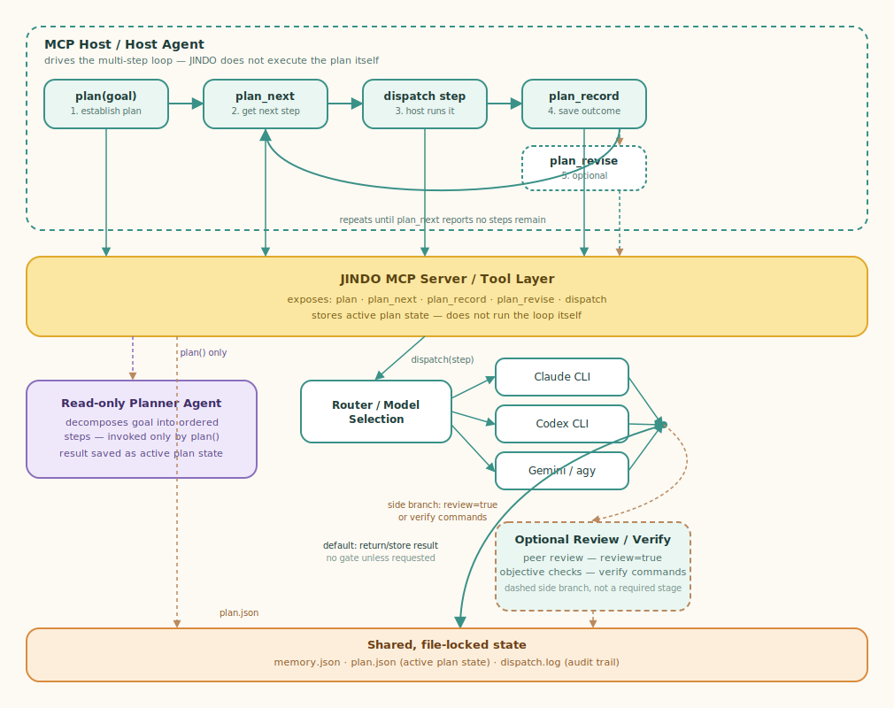

# JINDO — Joint Intelligence Network for Distributed Orchestration


**JINDO** makes several coding-agent LLMs — Anthropic **Claude**, OpenAI
**Codex**, Google **Gemini** (`agy`) — work as one. A host agent hands JINDO a
task; JINDO routes it to the right model(s), runs them headless, can have other
models review the result on request, and returns it — sharing context across
agents through a file-locked store.

The name maps to the design:

- **Joint Intelligence** — multiple models collaborate on one task: a single author,
  cross-model peer review, or a multi-model fan-out synthesized into one answer.
- **Network** — a pool of interchangeable agent CLIs (`claude`/`codex`/`agy`),
  detected at startup and routed to by capability, difficulty, and reasoning effort.
- **Distributed Orchestration** — a lean, stateless-per-task orchestrator that moves
  work and records outcomes; each sub-agent runs isolated, in its own process, from
  only the host-provided task plus bounded shared memory.

JINDO ships as a single-binary, dependency-free **Go MCP server** (`cmd/jindo-mcp`)
that any MCP host (Claude Code, Codex, `agy`) can register — see **[INSTALL.md](INSTALL.md)**.



## How it works

The **host drives the loop; JINDO executes the steps.** JINDO never runs a plan
unattended:

1. **`plan(goal)`** — a read-only planner decomposes the goal into ordered steps, and
   JINDO persists them as active plan state.
2. **`plan_next`** — the host asks for the next runnable step.
3. **`dispatch`** — the host runs that step (optionally pinning `model`/`effort`, or
   passing `review=true` / `verify` commands to gate it).
4. **`plan_record`** — the host records the outcome, optionally calling **`plan_revise`**
   to adapt the remaining steps.
5. Repeat from step 2 until no steps remain.

Single, short tasks skip the loop and just call `dispatch` once.

## Capabilities

- **Difficulty routing + host override** — a deterministic scorer (with an optional
  LLM-assess fallback) picks a tier → agent → model, or the host pins
  `model`/`agent`/`effort` directly.
- **Reasoning-effort routing** — per-tier effort (low/medium/high…) applied per CLI.
- **Multi-model collaboration** — `dispatch(review=true)` fans out cross-model peer
  review (with a security checklist) plus one bounded revision; `dispatch_multi` fans a
  task to several models and can have a judge synthesize the candidates.
- **Objective verify gate** — supply `verify` commands and JINDO runs allowlisted
  test/build/lint (+ security scanners) and gates on the result, with bounded
  auto-revision on failure.
- **Cross-agent memory** — a file-locked store plus a curated **insight layer** that
  lets each model benefit from what earlier models learned (see below).
- **Availability-aware** — agent CLIs are detected at startup; routing only uses the
  ones installed, and the `agents` tool reports availability.
- **Async** — `dispatch_async` + `job_status` for long tasks beyond the MCP tool timeout.
- **Self-improvement** — `calibrate` aggregates the dispatch audit log and can apply
  conservative routing tuning.

By default the routed tiers are **trivial → `agy`**, **standard → `claude`**,
**hard → `codex`**; the host can override any choice. See
[docs/routing_policy.md](docs/routing_policy.md) and [docs/model_policy.md](docs/model_policy.md).

## Tools

13 MCP tools, in three groups:

| group | tools |
|-------|-------|
| execution | `dispatch` · `dispatch_async` · `job_status` · `dispatch_multi` |
| planning / step loop | `plan` · `plan_next` · `plan_record` · `plan_revise` · `plan_status` |
| memory / ops | `memory` · `agents` · `compact` · `calibrate` |

Full reference and MCP registration: **[docs/jindo-mcp.md](docs/jindo-mcp.md)**.

## Shared, cross-agent memory

All agents read and write one file-locked store (default root `.jindo`), so a later
agent sees earlier agents' results. It has two tiers:

- **Task store** — `memory.json`: per-dispatch records (task, routing decision, result)
  plus a notes audit trail, atomically written under a cross-process lock.
- **Insight layer** — distilled, provenance-tagged learnings (e.g. "build cmd is
  `make build`", "auth lives in `internal/authz`"). Each carries which agent/model found
  it, a salience weight, and a hit count; re-derivation by any model **reinforces** it
  rather than duplicating. Before a dispatch, JINDO injects the few insights most
  **relevant** to the task as a short brief (not the whole store); after a successful
  run it contributes the summary back. This is how heterogeneous models teach each other.

Plan state (`plan.json`) and the dispatch audit trail (`dispatch.log`) live alongside.

## Install

```bash
make install      # build + register with every detected host (Claude/Codex/agy)
# or:  ./install.sh        (DRY_RUN=1 ./install.sh to preview)
```

This builds the binary, reports which sub-agent CLIs are on `PATH`, registers the
`jindo` server with each MCP host it finds (idempotent), and runs a handshake smoke
test. Manual per-host setup and runtime notes are in **[INSTALL.md](INSTALL.md)**
(Codex specifics: [docs/codex-install.md](docs/codex-install.md)).

## Build & test

```bash
go build -o jindo-mcp ./cmd/jindo-mcp   # single binary, standard library only
go test ./...
```

Host-independent stdio smoke test:

```bash
printf '%s\n%s\n' \
  '{"jsonrpc":"2.0","id":1,"method":"initialize","params":{}}' \
  '{"jsonrpc":"2.0","id":2,"method":"tools/list"}' | ./jindo-mcp
```

You should get an `initialize` result (`serverInfo.name = "jindo-mcp"`) followed by a
`tools/list` result listing the 13 tools.
